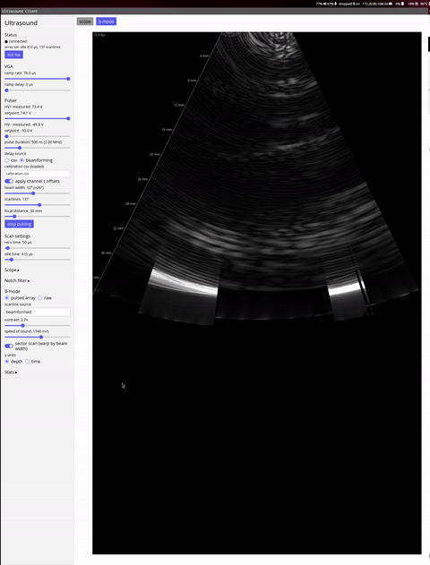
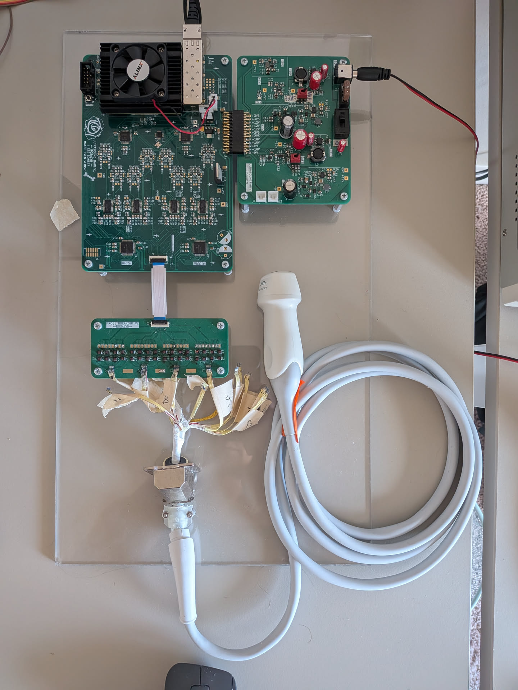

# Ultrasound

This repository contains the PCB design files, FPGA firmware files, and host software for a hobby 8 channel ultrasound system. It can do phased array operation. Here's an example of the pulse in my forearm:

Picture of the functioning ultrasound system:

## Overview

The parts of the ultrasound consist of:
- The probe, which is a Acuvision 4V1c probe bought off ebay
    - As far as I can tell, it has 112 elements. I think a bunch of them are broken for this unit, so I've atttempted to work around as best as possible
- The power board
    - This provides a variable voltage positive and negative rails for the pulser, -80V to +80V, as well as various low voltage supplies for the rest of the system (2.5V, 3.3V, +10V, -10V)
- The main logic board
    - Contains an AXAU15 FPGA SOM
      - 10G ethernet
      - JESD204b for the ADCs
      - Pulser logic
      - VGA control logic
      - Power supply control logic
    - 2x Ti ADC34J22 quad ADCs
        - And clock synthesis IC (Si5338)
    - 4x AD8332 dual LNA/VGA
    - 2x HV7321 quad ultrasound pulsers
    - Variable rate linear ramp circuit to control VGA gain
    - 10G ethernet interface
- Probe breakout board
    - Breaks out the connections from the probe to the main logic board, allowing for use of different probes without reworking the main board every time

The FPGA streams all the ADC data (~4Gbps) out the ethernet port to be processed on a host computer. The software programms beamforming patterns into the FPGA and interprets the ADC data

## Repo Tour

- `fpga/` - Contains the FPGA firmware that runs on the AXAU15 FPGA SOM
- `host/` - Contains the host software that communicates with the FPGA and processes the ADC data
- `pcb/ultrasound` - Contains the PCB design files for the main board
- `pcb/probe` - Contains the PCB design files for the probe breakout board
- `pcb/power-board` - Contains the PCB design files for the power board
- `pcb/simulations` - Contains various supporting spice simulations
